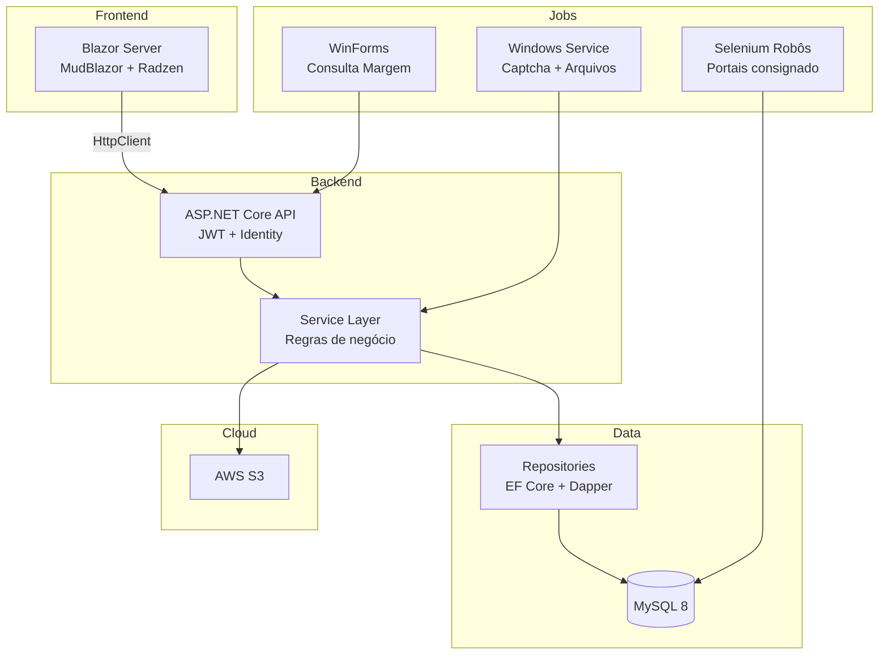

<h1 align="center">Olá, eu sou o Sóter Fernandes 👋</h1>
<h3 align="center">Desenvolvedor .NET · Blazor Server · Sistemas financeiros</h3>

  
  
  

---

### 👨‍💻 Sobre mim

Desenvolvedor focado em **aplicações corporativas** para o setor financeiro (consignado), com experiência em:

- **CRM multi-camadas** — Domain, Data, Service, API e frontend Blazor Server
- **APIs REST** com JWT, Identity e autorização por perfil
- **MySQL** com EF Core + Dapper em queries de alto volume
- **Background Services** — processamento de arquivos, exportação Excel, jobs agendados
- **Automação** — Selenium WebDriver para consulta de margem em portais governamentais
- **Integrações** — AWS S3, APIs parceiras, importação CSV e relatórios NPOI

Busco sempre código limpo, segurança em dados sensíveis (LGPD) e arquitetura escalável.

---

### 🛠 Stack principal

  
  
  
  
  
  
  
  

---

### 📌 Projetos em destaque

| Projeto | Descrição |
|---------|-----------|
| [**dotnet-crm-fintech-showcase**](https://github.com/soterfernandes/dotnet-crm-fintech-showcase) | Arquitetura de CRM financeiro em .NET — camadas, padrões e decisões técnicas |
| **FamCred CRM** *(privado)* | CRM de consignado em produção — propostas, margem, exportações analíticas e robôs |

> Confira os repositórios fixados abaixo para mais detalhes.

---

### 🏗 Visão geral da arquitetura (projeto principal)

---

### 📊 GitHub Stats

  

---

### 🐍 Contribuições

  

---

### 💡 Áreas de expertise

| Área | Tecnologias / práticas |
|------|------------------------|
| **Backend** | ASP.NET Core 6/8, Dapper, Dommel, Repository Pattern |
| **Frontend** | Blazor Server, MudBlazor, Radzen, JWT Session |
| **Banco** | MySQL, migrações EF, SQL otimizado, índices |
| **Automação** | Selenium Edge/Chrome, NCrontab, BackgroundService |
| **Relatórios** | NPOI Excel, CsvHelper, pipelines de exportação |
| **Segurança** | LGPD, mascaramento de CPF, JWT, perfis de acesso |

---

  

  <i>"Código que resolve problemas reais de negócio."</i>

